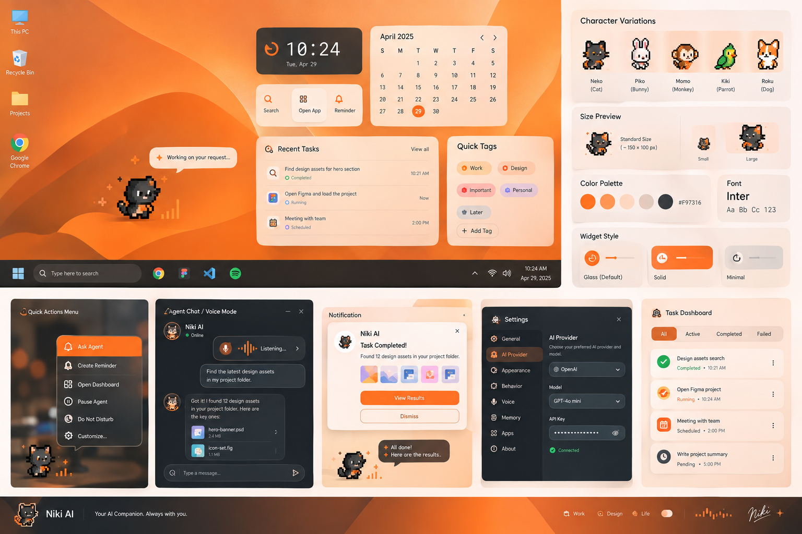

# 03 — Design System and Visual Specification

The image above is the selected visual reference supplied by the user. Use it as the primary visual direction for spacing, widget composition, character footprint, and overall feel.

Character-specific visual identity, anatomy, movable parts, personality, animation vocabulary, and reaction behavior are defined in:

- `11_DESKTOP_PET_CHARACTER_ANIMATION_SYSTEM.md`

AI-driven behavior composition is defined in:

- `12_DESKTOP_PET_AI_BEHAVIOR_DIRECTOR.md`

These documents extend the visual system without replacing the core Niki AI design language defined here.

## Design objective

Niki AI should look like a premium modern Windows utility, not a generic chatbot and not a game launcher.

The visual style combines:

- dark charcoal foundations;

- warm orange identity;

- controlled glassmorphism;

- subtle abstract/mathematical motifs;

- compact chunky utility cards;

- crisp 2D/pixel characters;

- restrained shadows;

- clean typography;

- consistent iconography.

Avoid fake depth. “Modern” should come from hierarchy, spacing, material treatment, and interaction polish rather than heavy 3D geometry.

The Desktop Pet should feel like a living part of the interface while remaining visually separate from the application's utility surfaces.

## Brand identity

### Primary brand color

**Niki Orange: `#F97316`**

Use this for:

- brand mark;

- primary action;

- selection;

- task progress;

- active state;

- notification accents;

- character highlight details where appropriate;

- important focus rings.

Character-specific colors may remain part of an approved character's own visual identity. Niki Orange must remain the application brand accent and must not be forced onto every character.

### Core surfaces

- Background: `#0F1115`

- Surface 1: `#151922`

- Surface 2: `#1B212B`

- Surface 3: `#222A35`

- Border: `rgba(255,255,255,0.08)`

- Strong border: `rgba(255,255,255,0.14)`

### Typography

- Primary text: `#F8FAFC`

- Secondary text: `#B8C0CC`

- Muted text: `#7E8795`

- Disabled text: `#626A76`

### Semantic status colors

Only use these when their semantic meaning is required:

- Success: `#22C55E`

- Warning: `#F59E0B`

- Error: `#EF4444`

- Info: `#60A5FA`

Do not turn semantic colors into decorative theme colors.

## Typography

Primary typeface:

**Inter**

Use a consistent type scale.

Suggested hierarchy:

- Display: 32/40

- H1: 24/32

- H2: 18/24

- H3: 15/20

- Body: 14/20

- Small: 12/16

- Micro: 11/14

Weight guidance:

- Display/H1: 600

- H2/H3: 600

- Body: 400

- Metadata: 400/500

- Buttons: 500/600

Do not mix multiple UI fonts.

Character artwork may use its own visual/pixel language and does not need to use Inter internally. Any character UI labels, names, metadata, or controls must use the application typography.

## Icons

Use one consistent icon family across the product.

Recommended:

**Lucide-style outline icons**

Rules:

- default size 18–20 px;

- 1.75–2 px visual stroke;

- consistent corner treatment;

- never mix filled icon families with outline icons inside the same navigation;

- active icons may use Niki Orange.

Character-specific expressive symbols, effects, particles, and stickers are treated as part of the character expression layer rather than the application's primary icon system.

## Shape language

- Card radius: 14–18 px

- Small controls: 10–12 px

- Pills: 999 px

- Button height: 38–44 px

- Compact widget tile: 12–16 px radius

Do not use excessive rounded “bubble” shapes everywhere.

Character silhouettes should preserve their own approved shape language. Do not force every character into identical proportions, containers, or silhouette shapes merely for visual consistency.

## Glassmorphism

Use glass as a material layer, not as an effect on every element.

Default glass recipe:

- translucent dark surface;

- backdrop blur around 18–24 px where supported;

- thin low-opacity border;

- subtle shadow;

- moderate background separation.

Glass is preferred for:

- desktop overlay;

- compact launcher;

- notification/result popup;

- floating character bubble;

- widget shelf.

Solid surfaces are preferred for:

- dense settings;

- long lists;

- complex task tables;

- developer/debug screens.

The Desktop Pet itself should normally render directly against transparency rather than inside a permanent glass card or avatar container.

## Background treatment

The product may use an abstract orange-and-charcoal background inspired by mathematical curves, graphs, grids, lines, nodes, or flowing geometry.

Rules:

- background is decorative;

- content must remain readable;

- no noisy pattern behind dense text;

- use a small number of shapes;

- avoid stock “AI circuitry” clichés;

- do not use rainbow gradients.

## Abstract graph / mathematical motif

Allowed motifs:

- sparse graphs;

- coordinate axes;

- thin plotted curves;

- small nodes;

- vector arrows;

- numerical grid fragments;

- abstract formulas used as texture.

They should feel like a design language, not a science dashboard.

Use low opacity so they never compete with the task content.

## Main desktop companion

### Default footprint

150 × 100 px visible canvas.

The companion should occupy little space, sit near a screen edge, and remain readable.

The 150 × 100 px footprint is a default visual target, not a requirement that every character must have the same physical proportions.

Characters with different silhouettes may require internal scaling or positioning adjustments while remaining within the intended companion footprint.

### Character container

Prefer:

- transparent background;

- no large circular avatar frame;

- optional tiny orange status dot;

- optional compact speech bubble.

The character should remain visibly independent from utility UI.

Do not place the character inside a permanent card, dashboard tile, or framed avatar container unless a specific feature explicitly requires it.

### Speech bubble

Use a small dark glass bubble with:

- concise text;

- maximum 1–2 short sentences;

- small tail;

- orange status indicator or icon.

Speech bubbles must not become a permanent label attached to the character.

Do not automatically display generic task-state text such as “Done” above the character unless explicitly required by a product feature.

### Compact launcher

On hover or click, reveal a slim vertical or horizontal action bar:

- Ask

- Tasks

- Reminder

- Open Panel

- Settings

No more than 5 immediate actions.

## Character visual system

The Desktop Pet is a collection of distinct character identities rather than a single generic sprite with interchangeable skins.

The active roster consists of:

- Niki;

- Dog;

- six approved character identities represented by the current character mockups.

Three legacy characters are deprecated from the active roster. Their removal must be verified against the actual project asset/character registry before deletion.

The six new characters must retain their own visual identity. Their appearance, silhouette, proportions, clothing, accessories, equipment, colors, facial design, and other defining visual features must not be normalized into one generic character template.

Character-specific visual authority belongs to `11_DESKTOP_PET_CHARACTER_ANIMATION_SYSTEM.md`.

### Character personality consistency

Visual appearance and behavioral presentation should reinforce one another.

A character should not routinely perform movements, expressions, or emotional reactions that visually contradict its established identity.

For example:

- a reserved character should not constantly behave like an hyperactive mascot;

- a cheerful character should not permanently appear emotionally flat;

- a serious or stoic character should have a different reaction language from a playful character;

- an animal character should preserve species-specific movement cues;

- a human/waifu-style character should preserve human body mechanics and posture;

- a mechanical, armored, or costumed character should account for the physical constraints implied by its design.

These are design-consistency rules, not a requirement that a character can never display an opposite emotion. Contextual emotions such as sadness, surprise, embarrassment, excitement, frustration, or celebration may occur when behaviorally appropriate.

### Character anatomy and articulation

Character artwork should be treated as potentially articulated visual assets rather than a single immutable image.

Where the source design supports it, movable elements may include:

- head;

- eyes;

- mouth;

- hair;

- ears;

- arms;

- hands;

- torso;

- clothing;

- accessories;

- legs;

- feet;

- tail;

- wings;

- props;

- equipment;

- mechanical components.

The exact decomposition is character-specific.

The system should preserve the original visual appearance while allowing individual body parts to move naturally.

Do not rely solely on:

- whole-sprite translation;

- simple vertical bobbing;

- edge deformation;

- scaling the complete sprite;

- repetitive single-frame shaking.

Movement should visibly involve appropriate body parts when the selected behavior requires it.

### Character-specific motion language

Each character should have:

- characteristic idle motion;

- characteristic posture;

- characteristic movement rhythm;

- signature animation;

- signature reaction;

- character-specific expressive behavior.

Two characters may perform the same high-level action while expressing it differently.

For example, walking, greeting, celebrating, becoming tired, or reacting to a notification should not necessarily look identical across the roster.

### Dynamic movement

The character system must support composed movement rather than only fixed complete animation clips.

A behavior may combine multiple articulated movements such as:

- eye movement;

- head turn;

- posture change;

- arm movement;

- stepping;

- walking;

- leaning;

- jumping;

- sitting;

- standing;

- reaching;

- waving;

- recovering;

- prop interaction.

The AI Behavior Director may compose such movements from approved capabilities.

Dynamic movement must remain:

- anatomically plausible for the character;

- consistent with the character's personality;

- visually coherent;

- resource-bounded;

- compatible with the available character assets.

### Character effects and expressive elements

Characters may use a separate lightweight expression/effect layer.

Possible elements include:

- contextual symbols;

- particles;

- small visual effects;

- hearts;

- stars;

- sweat/drop marks;

- musical notes;

- celebration effects;

- surprise indicators;

- mood symbols;

- themed stickers;

- character-specific visual reactions.

These elements should be generated or selected according to the active character's visual language.

They must not become noisy permanent decorations.

The application may support AI-composed expressive elements, but they must remain within the approved visual/design system and must not introduce arbitrary UI styles.

## Main dashboard

Recommended layout:

### Left navigation

- Home

- Chat

- Tasks

- Memory

- Apps

- Widgets

- Settings

### Main content

- greeting;

- command input;

- quick actions;

- today’s overview;

- task list;

- optional context widget.

### Right rail

Optional for:

- weather;

- time;

- AI task progress;

- quick notes.

Do not overload the first screen.

## Chat

The chat page should include:

- compact header;

- current character/avatar;

- online/running state;

- conversation area;

- tool progress cards;

- artifact cards;

- composer;

- voice button.

When an agent task is running, show explicit progress rather than only “typing...”.

Example:

- Searching sources

- Reading 4 pages

- Summarizing findings

- Preparing report

The current character may react contextually to task progress, but those reactions must remain secondary to the actual task information.

## Tasks

Use a segmented header:

- All

- Active

- Upcoming

- Completed

- Failed

Each task row:

- status icon;

- title;

- time;

- state;

- context;

- overflow menu.

Task detail page:

- request;

- plan summary;

- timeline;

- actions;

- approvals;

- results;

- artifacts;

- rerun.

## Memory

Tabs:

- Short-term

- Long-term

- Timeline

Cards should clearly communicate:

- what was remembered;

- when it was created;

- why it exists;

- edit/delete controls.

Character personality adaptation must remain subordinate to the application's memory and privacy controls.

## Apps

Sections:

- Installed

- Recent

- Favorites

Each app row:

- icon;

- app name;

- executable metadata only when useful;

- last used;

- quick actions.

Do not assume Google Chrome exists; support available browsers such as Edge or Brave.

## Settings

Sections:

- General

- AI Provider

- Appearance

- Behavior

- Voice

- Memory

- Apps

- Notifications

- Privacy & Security

- About

Use progressive disclosure. Advanced controls should not dominate the default settings page.

Behavior settings should expose the user-controlled personality adaptation option when that feature is available.

## Character gallery

The gallery should show the full active roster in a consistent grid.

Recommended presentation:

- small sprite preview;

- name;

- category;

- short personality line;

- selected state in orange.

The gallery should communicate that characters are distinct identities rather than interchangeable skins.

### Human/waifu characters

These should be anime-inspired but original-looking. Avoid copying recognizable copyrighted character designs. Keep details readable at small sizes.

Human characters should preserve believable body proportions, posture, clothing movement, and human-like articulation appropriate to their approved design.

### Animal characters

Cats, dogs, rabbits, parrots, monkeys, foxes, etc. should use a consistent pixel language and silhouette complexity.

Animal movement should preserve species-appropriate motion cues where applicable.

### Character-specific designs

Characters that are mechanical, armored, fantasy-based, costumed, or otherwise structurally different should preserve the movement limitations and visual logic implied by their design.

Do not flatten all characters into the same animation grammar.

## Pixel-art rules

- crisp nearest-neighbor scaling;

- no blur on the sprite itself;

- limited palette;

- consistent outline;

- avoid excessive tiny details;

- readable silhouette at 150 × 100;

- preserve character-specific silhouette and proportions;

- preserve important visual details needed for identity;

- separate movable visual parts where the approved character design supports articulation.

The system should support both sprite-frame animation and articulated/layered movement.

Fixed frame-count ranges are guidance for lightweight sprite animations, not a hard architectural limitation.

Recommended baseline ranges for simple frame-based motions:

- idle: 2–4;

- walk: 4–8;

- run: 6–8;

- happy: 4–6;

- notification: 3–6;

- sleep: 2–4;

- thinking: 3–5.

For articulated or dynamically composed movement, the number of visual states/poses may vary according to the required action.

Animation quality should be judged by:

- natural movement;

- visual coherence;

- silhouette stability;

- appropriate timing;

- character identity;

- resource usage;

rather than frame count alone.

## Widget language

Widgets should feel like a coherent family.

Every widget has:

- icon;

- title;

- one primary value;

- optional secondary data;

- one small action.

Widget density should be compact, not dashboard-like.

## Widget surface variants

### Glass

Default.

- translucent;

- light blur;

- thin border.

### Solid

For performance or visual clarity.

- opaque surface;

- no backdrop blur.

### Minimal

For the smallest footprint.

- icon;

- data;

- almost no chrome.

All three must use the same typography, spacing, icon set, and orange accent.

## Responsive behavior

Even though the primary release is Windows desktop, panels should handle:

- 1366 × 768;

- 1920 × 1080;

- scaled Windows display settings;

- narrow laptop screens.

Do not rely on fixed coordinates for the entire UI.

The Desktop Pet may use a controlled fixed footprint while the rest of the interface remains responsive.

## Motion design

Motion should be purposeful.

Use:

- 150–220 ms micro-interactions;

- 220–320 ms panel transitions;

- gentle ease-out;

- no constant pulsing;

- no infinite decorative animations except the tiny character idle loop.

Character animation is an intentional exception to generic UI motion rules because the Desktop Pet is designed to feel alive.

However, character motion must still be:

- bounded;

- context-aware;

- personality-consistent;

- performance-aware;

- interruptible by higher-priority states.

Dynamic character behavior must not become constant visual noise.

Character expressions are strictly visual and symbolic via `ExpressionOverlayControl` with bounded duration (0.5s–2.5s) and character-specific themes; legacy speech bubble text badges above the pet are completely removed.

When the companion window is hidden or minimized, frame pacing and casual idle timers stop completely to preserve system resources.

Reduced Motion setting (`Companion.ReducedMotion`, decoupled from high contrast) suppresses temporary physics offsets to identity, reduces locomotion, and simplifies graphical expression overlays.

Essential status communication must remain available in a non-motion form.

## Professional polish checklist

Before declaring the design finished, verify:

- one font family;

- one icon family;

- one primary accent;

- consistent spacing;

- consistent corner radius;

- consistent button height;

- consistent text hierarchy;

- consistent focus state;

- consistent empty states;

- consistent loading states;

- consistent error states;

- no arbitrary colors;

- no random gradients;

- no unnecessary glow;

- no 3D-heavy UI;

- no oversized character;

- character identity remains visually distinct;

- character movement uses appropriate body parts where applicable;

- character reactions remain personality-consistent;

- expressive effects remain restrained;

- Desktop Pet remains visually separate from utility UI;

- reduced-motion behavior works correctly.

## Reference image interpretation

The provided visual reference is approved mainly for:

- compact widget composition;

- orange/dark identity;

- small pixel companion;

- utility-first desktop layout;

- approachable glass/solid mix;

- card-based task and notification surfaces.

The final implementation should refine these ideas into a more restrained professional system rather than reproduce the board literally.

The reference does not override the individual identity of any approved character. Character appearance, articulation, personality, and animation behavior must follow the approved character-specific definitions in `11_DESKTOP_PET_CHARACTER_ANIMATION_SYSTEM.md`.

The AI-driven behavior system defined in `12_DESKTOP_PET_AI_BEHAVIOR_DIRECTOR.md` may dynamically compose character movement and reactions, but all resulting visuals must remain within this design system and the character's approved visual identity.